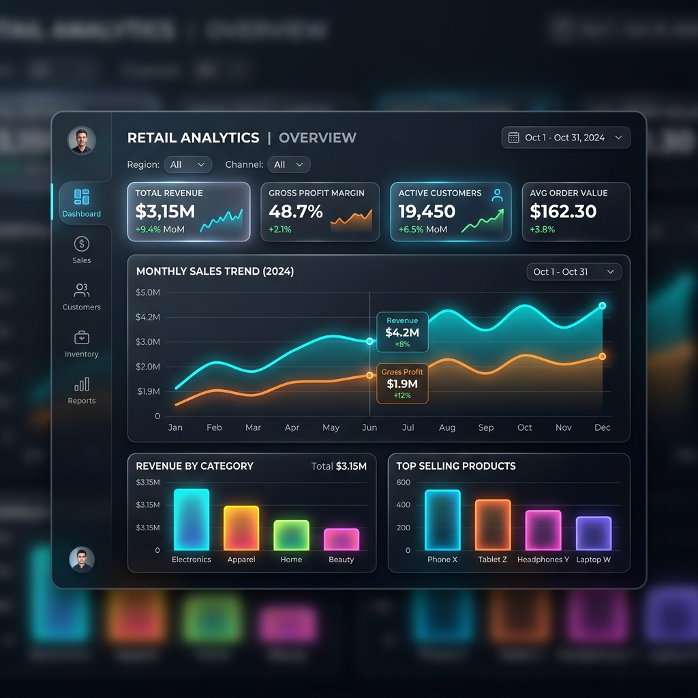
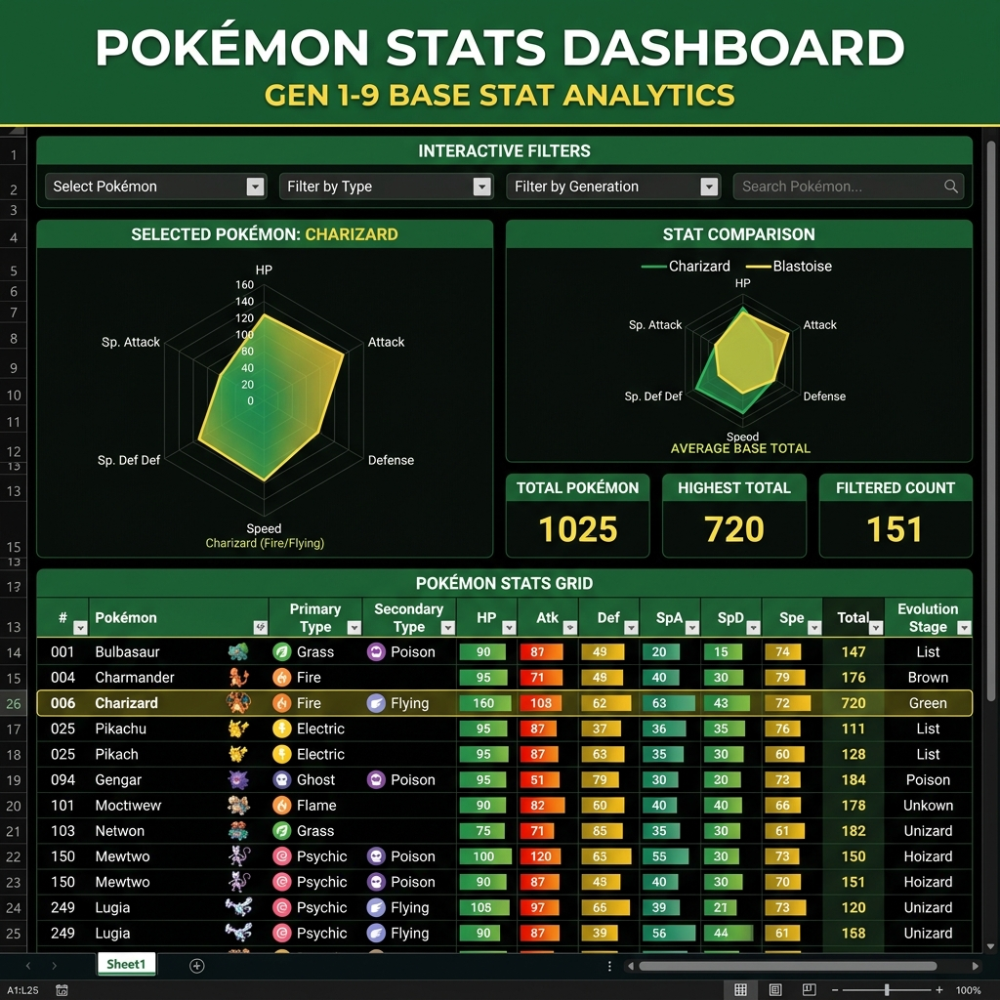
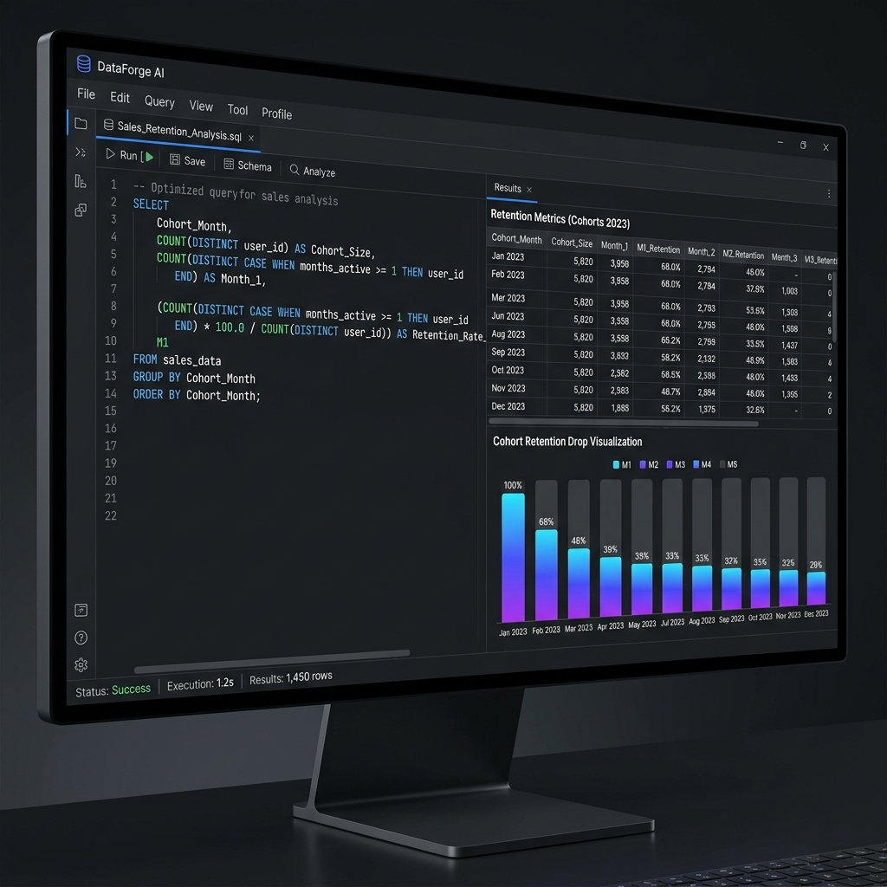

# 📊 Aryan Prasad's Portfolio

<div align="center">
  
  [](#-connect-with-me)
  [](https://thearyanprasad.github.io)
  [](./aryan_resume.pdf)

  <h3>A premium, responsive, and minimalist developer portfolio showcasing data analytics and software projects.</h3>
  
  <p align="center">
    Built with pure <strong>HTML5</strong>, <strong>CSS3</strong> (Vanilla), and <strong>ES6+ JavaScript</strong>. 
    <br />
    No external libraries, no frameworks, fully optimized, and fast.
  </p>
</div>

---

## 🛠️ Technology Stack & Tools

To build my analytics and web projects, I leverage a robust toolkit designed to extract insights and deliver visual impact:

| Category | Tools & Technologies |
| :--- | :--- |
| **Data Analytics & BI** |     |
| **Databases** |   |
| **Languages** |   |
| **Web Development** |   |
| **Tools & Platforms** |   |

---

## ✨ Portfolio Key Features

This portfolio website is not just a showcase of my projects, but is itself a demonstration of front-end capabilities:

*   🎯 **Custom Smooth Cursor:** A customized dual-ring tracking cursor that accelerates and aligns dynamically with your mouse trajectory.
*   🌓 **Smart Theme Toggle:** Toggle effortlessly between sleek Dark and premium Light modes (fully persisted in the user's `localStorage`).
*   🎨 **SVG Grain Texture Filter:** A custom SVG noise displacement turbulence filter applied over the page overlay to create a tactile hand-drawn texture feel.
*   🚀 **Scroll-Reveal Animations:** Sleek delay-staggered fade-up sections implemented with intersection observers to elevate visual hierarchy.
*   ✉️ **No-Refresh Contact Form:** A native contact modal connected with the Web3Forms API to send secure email alerts without page reloads.

---

## 📈 Selected Case Studies & Analytics Works

### 1. LV Analytics Dashboard — Retail Domain
> **Business Value:** Addressed quarterly performance metrics to highlight underperforming products and pinpoint key leakage vectors.
*   **Key Accomplishment:** Developed an interactive BI dashboard tracking **15+ retail KPIs** utilizing advanced **DAX modeling** and user-experience patterns, highlighting a **12% revenue leakage** in sales.
*   **Tech Stack:** `Power BI`, `DAX`, `Data Storytelling`, `KPI Analysis`
*   **Project Link:** [View LV Dashboard Repository](https://github.com/thearyanprasad/LV-Analytics-Dashboard)

<p align="center">
  
</p>

---

### 2. Pokémon Analytics Dashboard — Entertainment Domain
> **Data Processing:** Automated search indexes and metrics calculation over a dataset containing base stats of 800+ characters.
*   **Key Accomplishment:** Built a complex interactive Excel dashboard using multi-index **Pivot Tables**, interactive **Slicers**, and customized chart grids, reducing manual data filtration time by **35%**.
*   **Tech Stack:** `Excel`, `Pivot Tables`, `Slicers & Charts`, `Conditional Formatting`
*   **Project Link:** [View Pokémon Dashboard Repository](https://github.com/thearyanprasad/pokemon-excel-dashboard)

<p align="center">
  
</p>

---

### 3. SQL Sales Analysis Project — E-Commerce Domain
> **Database Optimization:** Crafted structured, multi-join queries to process transaction logs containing over 50,000 records.
*   **Key Accomplishment:** Authored optimized MySQL scripts to conduct historical cohort analysis, identifying an **18% drop in seasonal customer retention** to directly guide the advertising strategy.
*   **Tech Stack:** `MySQL`, `Relational Databases`, `Cohort Analysis`, `Business Reporting`
*   **Project Link:** [View SQL Sales Analysis Repository](https://github.com/thearyanprasad/sql-sales-analysis)

<p align="center">
  
</p>

---

## 🎓 Education & Professional Journey

*   💼 **Data Analytics Industrial Intern** | Eagletfly Solutions Pvt Ltd  *(Jan 2026 – Jun 2026)*
    *   Designed dashboards, automated queries, and generated business intelligence briefs.
*   🎓 **Bachelor of Computer Applications (BCA)** | Indira Gandhi National Open University (IGNOU)  *(Expected Graduation: 2027)*
    *   Focus on database systems, computer science fundamentals, and data management.
*   🏫 **Academic Foundations:**
    *   **CBSE Class 12:** 79% score.
    *   **CBSE Class 10:** 83% score.

---

## 💻 How to Run Locally

You can spin up this portfolio on your system in seconds without installing any Node packages or dependencies:

1.  **Clone the Repository:**
    ```bash
    git clone https://github.com/thearyanprasad/Portfolio.git
    cd Portfolio
    ```
2.  **Launch the Page:**
    *   Simply double-click `index.html` to run it locally in any web browser, OR
    *   Right-click `index.html` inside VS Code and choose **Open with Live Server** to enable hot reloading.

---

## 🤝 Connect With Me

I am actively searching for junior role opportunities and collaborations in **Data Analytics**, **Business Intelligence**, and **SQL Database Management**. Let's talk data!

<p align="left">
  <a href="mailto:prasadaryan.work@gmail.com">
    
  </a>
  <a href="https://www.linkedin.com/in/prasadaryan9354" target="_blank">
    
  </a>
  <a href="https://github.com/thearyanprasad" target="_blank">
    
  </a>
  <a href="https://www.instagram.com/madmello_aryan/" target="_blank">
    
  </a>
</p>
